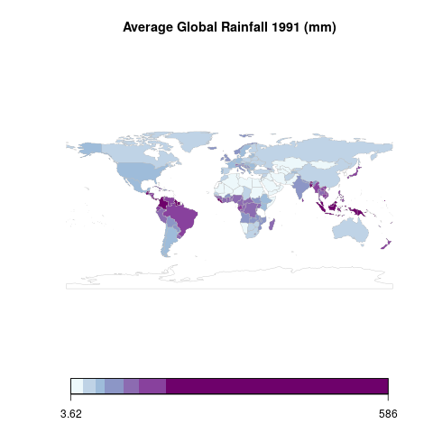
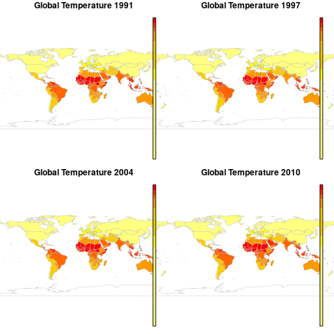
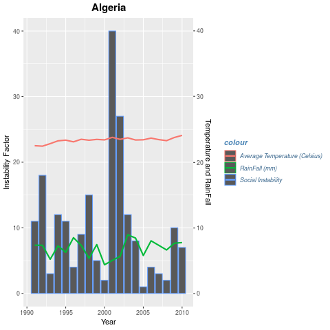
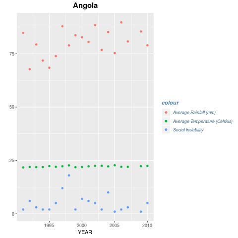
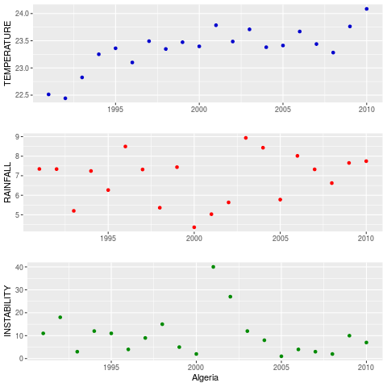

# data-science
## Climate history maps/graphs in R
```
Rest of the plots can be generated by running the scripts
```

The generated graphs are in png format.

Optionally, you can generate graphs in tiff format for better resolution.

Graphs for all the countries can be generated by running the R scripts.

### Maps using ISO Codes


### Comparison Map Subplots


### Linebar Plot


### Scatter Plot


### Subplots

